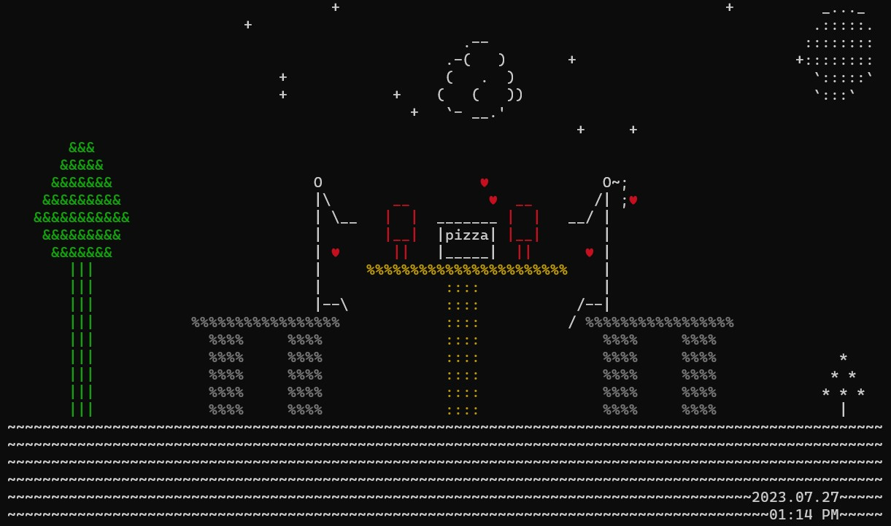

<p align="center">
  
</p>

# Stochastic ASCII Art Generator

[](https://opensource.org/licenses/MIT)
[](https://github.com/your-username/stochastic-ascii-art-generator/issues)
[](https://github.com/your-username/stochastic-ascii-art-generator/pulls)
[](https://www.bingai.ai/)

Unleash the Enchantment with the awe-inspiring power of BingAI's Prompt Engineering, driving the Stochastic ASCII Art Generator to reveal captivating ASCII masterpieces that will leave you in awe, each brimming with the unmistakable brilliance of creative artistry!

---

## Overview

The Stochastic ASCII Art Generator is an innovative project that harnesses the power of BingAI's Prompt Engineering to create mesmerizing ASCII art. With each run of the program, a new piece of art emerges, all sharing the same captivating theme and style.

## Key Features
- **Human-Driven Design:** Every artwork reflects the artistic touch of the developer (myself), ensuring a harmonious blend of human intelligence and AI brilliance.

- **BingAI's Prompt Engineering:** Experience the cutting-edge prompt engineering capabilities of BingAI, driving the heart of the Stochastic ASCII Art Generator.

- **Unpredictable Creativity:** Embrace the allure of unpredictability as each run produces a fresh, yet thematically coherent, ASCII masterpiece.

## Note
The image above is one of the stochastically generated ASCII Art. 

## How to Use

1. **Clone the Repository:**
```bash
git clone https://github.com/your-username/stochastic-ascii-art-generator.git
cd stochastic-ascii-art-generator
```
2. **Run the Generator:**
```bash
python ascii_art_generator.py
```

## Contributions and Issues

Contributions are welcome! If you find any issues or have ideas for improvements, please open an issue or submit a pull request. Let's collaborate and take this project to new heights together.
